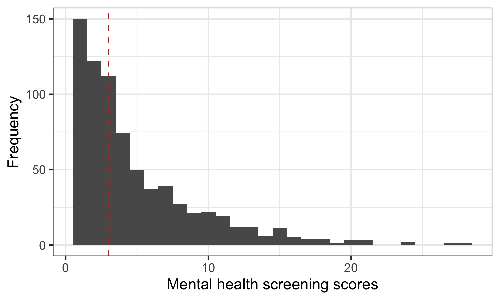
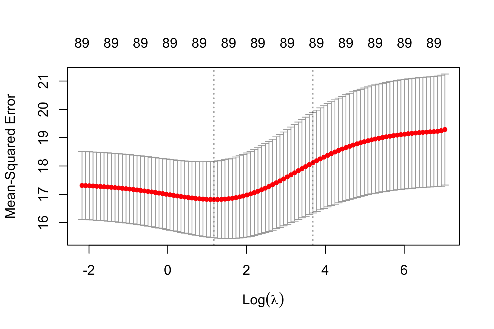
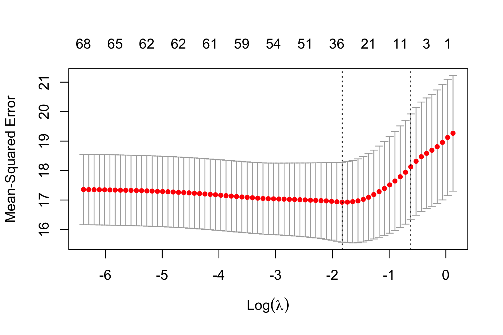
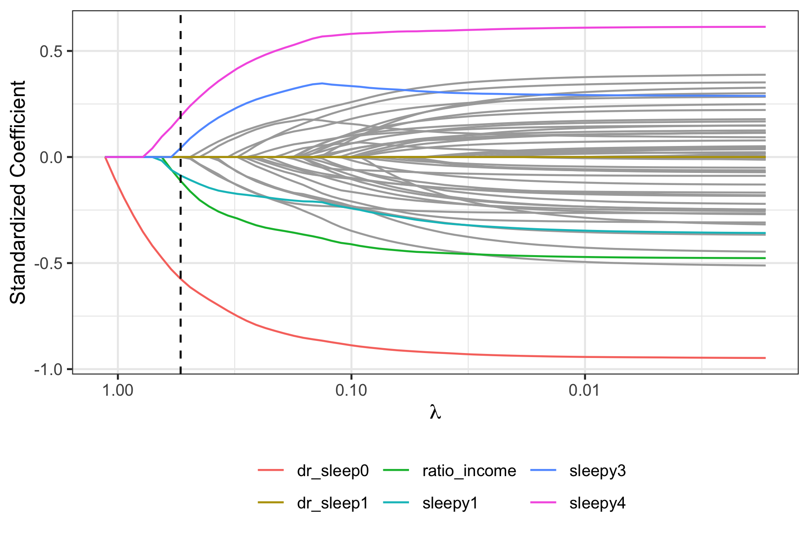
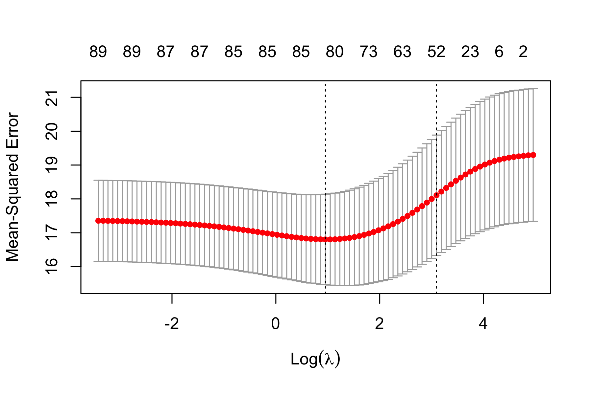
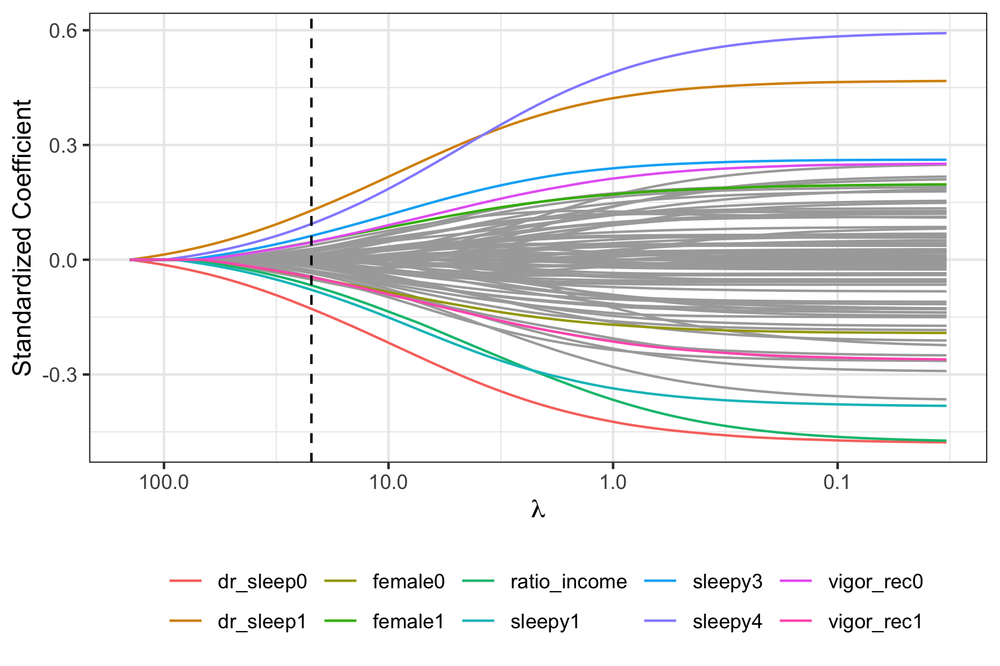

```{r setup, include=FALSE, message = FALSE}
options(scipen = 0, digits = 3)  # controls number of significant digits printed
library(tidyverse)
library(kableExtra)
```

\bigskip

The code to reproduce this report is available [on Github](https://github.com/dphamvu/NHANES).

\newpage

# Executive Summary

**Problem.** Despite the growing body of research focused on understanding the progression of COVID-19, there is still much to be learned about population-level health factors that make some populations more susceptible to COVID-19 spread, case severity, and mortality. Hence, for our final project, we decided to look into various measures of health across US counties and analyze which factors were most predictive of case fatality rate throughout 2020, the first year of the COVID-19 pandemic. While only analyzing 2020 COVID-19 data only inherently limits our results, we also note 2020 data may actually be most likely to reflect differences in healthcare quality across counties, as it was in the early months of the pandemic that many health systems faced unique issues of resource scarcity.

**Data.** Our dataset pulled data from two sources: a New York Times time series dataset which includes cumulative counts of COVID-19 cases and deaths at the county level, and data from County Health Rankings & Roadmaps, a program focused on collecting county-level data on a variety of health determinants. For the latter data source, we pulled 2019 or older data from various datasets on their website, as many key variables we wanted to study are still missing for 2020 and we assume that most county-level health determinants stayed very similar from 2019 to 2020. Our explanatory variables span the four main categories of health factors that the program identifies: health behaviors (e.g., smoking, sexual activity), clinical care (e.g., flu vaccine rate), social and economic factors (e.g., unemployment rate), and physical environment (e.g., degree of air pollution). Our primary response variable of interest was deaths per cases, which we created by dividing county-level deaths by count-level cases.

**Analysis.** Before exploring our data or running any analyses, we split our data into a training dataset and a test dataset, with the test dataset reserved for assessing and comparing model performance. Then, we explored our data to check for normality assumptions necessary for linear regression and to assess correlations between variables and between variables and the response. In order to build an optimal predictive model, we then built six different cross-validated models: ordinary least squares, ridge regression, LASSO regression, elastic net regression, random forest, and boosting. Of the regression models, elastic net had the lowest test error and of the tree-based models, the boosted model had the lowest test error (as well as the lowest test error overall).

**Conclusions.** Interestingly, we found that the boosted and elastic net regression both pointed to similar types of variables as the strongest predictors of deaths per cases. Specifically, our optimal boosted model revealed that variables related to residential segregation and unemployment emerged as the most significant predictors, revealing that structural economic and health access inequalities were more predictive of COVID-19 deaths per cases than other variables. We hope that this analysis can inform policies aimed at improving health outcome determinants, both in the context of COVID-19 and more generally going forward. 

# Introduction

**Background.** Coronavirus disease (COVID-19) has had a devastating global impact, with a cumulative total of 149,987,772 confirmed cases and 3,157,594 deaths worldwide as of April 28, 2021.^[Coronavirus Cases: Worldometer. (n.d.). https://www.worldometers.info/coronavirus/. 
] About a fifth of these cases have been in the United States, with a recent count of 32,551,440 cases and 582,668 deaths.^[Ibid.] With these staggering numbers still increasing despite recent large-scale vaccine rollouts, it is of vital importance to utilize various data sources to understand both the progression of COVID-19 thus far as well as the highest risk factors for contracting COVID-19. Furthermore, a thorough analysis of COVID-19 rates and predictive factors may help inform strategies to improve public health policies that could mitigate the negative impact of a future pandemic, which many scientists say is not a matter of if but of when.^[Robbins, J. (2021, January 4). Heading Off the Next Pandemic. Kaiser Health News. https://khn.org/news/infectious-disease-scientists-preventing-next-pandemic/. ]

Past research has shown that infectious diseases are influenced by a variety of factors. Obesity, for instance, is associated with a higher likelihood of contracting influenza A, and seasonal temperature changes have shown to be predictive of the 2003 severe acute respiratory syndrome (SARS).^[Tian, T., Zhang, J., Hu, L., Jiang, Y., Duan, C., Li, Z., ... & Zhang, H. (2021). Risk factors associated with mortality of COVID-19 in 3125 counties of the United States. Infectious diseases of poverty, 10(1), 1-8.] The CDC is currently in the process of identifying potential risk factors for severe COVID-19 illness,^[Centers for Disease Control and Prevention. (n.d.). Assessing Risk Factors for Severe COVID-19 Illness. Centers for Disease Control and Prevention. https://www.cdc.gov/coronavirus/2019-ncov/covid-data/investigations-discovery/assessing-risk-factors.html.] and some that have already been identified include heart disease, diabetes, and pregnancy.^[Centers for Disease Control and Prevention. (n.d.). Certain Medical Conditions and Risk for Severe COVID-19 Illness. Centers for Disease Control and Prevention. https://www.cdc.gov/coronavirus/2019-ncov/need-extra-precautions/people-with-medical-conditions.html.] Yet despite these efforts, there is still much to be learned. Specifically, there is still insufficient research to explain the differences in COVID-19 susceptibility and mortality that exist not just on the individual level but also on broader population levels. 

**Analysis goals.** Given our knowledge of the capacity for a variety of factors to influence infectious disease spread as well as the fact that different counties in the US have differing levels of baseline health factors, we sought to investigate how rates of COVID-19 cases and deaths across the US are affected by various measures of community health. Specifically, we were interested in which kinds of factors (e.g., clinical, behavioral, health)—and which specific variables—are most predictive of deaths per cases (also known as case fatality rate). 

**Significance.** We hope that our analysis will contribute to the growing body of research on COVID-19 risk factors by expanding our understanding of COVID-19 and supporting efforts to mitigate the risk of future pandemics. Our results also shed light on the importance of analyzing social determinants of health in efforts to improve health outcomes. 

# Data

## Data sources

Our dataset merged data from two sources: a dataset on US county-level health and a COVID-19 dataset that includes average cases and deaths per county. Each data source includes data from January 2020 to December 2020. 

The data regarding the health status of each county comes from County Health Rankings & Roadmaps, a program founded by the Robert Wood Johnson Foundation in collaboration with the University of Wisconsin Population Health Institute.^[County Health Rankings & Roadmaps. (n.d.) https://www.countyhealthrankings.org/] The program was designed to support community leaders in fostering equitable health outcomes by raising awareness about the variety of factors that influence length and quality of life, including economic and social factors. Specifically, the program considers all of the counties in the United States and includes measures of health behaviors, clinical care, social and economic factors, and the physical environment. In order to ensure a wide variety of explanatory variables in our dataset across the aforementioned categories, we pulled variables from the compiled dataset available on the program’s website and merged these variables into our final dataset.^[County Health Rankings & Roadmaps. (n.d.) 2021 Measures. https://www.countyhealthrankings.org/explore-health-rankings/measures-data-sources/2021-measures]

The other dataset we drew from is the New York Times COVID-19 tracking dataset that includes cumulative COVID-19 cases and deaths in the United States at the county level.^[The New York Times Github. (n.d.) nytimes/covid-19-data. https://github.com/nytimes/covid-19-data] This time series dataset, compiled from state and local governments and health departments, includes data beginning from the first reported coronavirus case in Washington on Jan. 21, 2020. Times notes that because of the widespread shortage of testing in the first few months of the pandemic, the true COVID-19 prevalence—for those few months especially—may not be accurately represented in the data.  

## Data cleaning

Our central task in the data cleaning phase of the project was merging the data from the two sources described above. Both data sources provided their respective data on a county level (classified as a 5-digit FIPS code). For each county in the New York Times COVID-19 dataset, the numbers of deaths and cases of COVID-19 were aggregated across 2020. We merged the two datasets on the county level, and then calculated the explanatory variables in accordance with the County Health Rankings Data Documentation. For the most part, the latter step consisted of dividing raw counts of a variable by the population of interest for the variable to calculate a percentage. 

## Data description

### Observations

Our dataset has a total of 922 observations, 41 features and one response variable.

### Response Variable

Our response variable is the cumulative COVID-19 deaths per cases for each county in the US. We created this variable via a simple mutate operation of cumulative cases per county divided by cumulative deaths per county. We use deaths per cases as our response variable as a proxy for case severity in different counties across the United States, as it inherently controls for population size variability. We do acknowledge, however, that using a single COVID-19 metric may not account for underlying heterogeneities between subgroups in each county, a bias that results from varied distributions within and between populations.^[U.S. News & World Report. (n.d.). COVID-19 Death Rate | Healthiest Communities. U.S. News & World Report. https://www.usnews.com/news/healthiest-communities/coronavirus-data/covid-death-rate?chart_type=line.]

### Features

Drawing on data from County Health Rankings & Roadmaps, we included 41 explanatory variables in our analysis, which fall into four main categories: health behaviors, clinical care, social and economic factors, and physical environment. For a detailed specification of these variables, refer to Appendix \@ref(appendix).

## Data allocation

Before building our predictive models, we first removed observations from the dataset for which any variables had NA values. We decided to do this for consistency purposes, as some data analysis methods we employed require that no variables contain NA fields. We then split our dataset into two subsets: a training dataset used for building our predictive models and a test dataset used for evaluating our models. We used an 80-20 split, such that the training dataset consists of 80% of our observations and the dataset consists of 20% of our observations. Although this train-test split was performed separately for each class of methods, we utilized a random seed to ensure that each split led to the same results. 

## Data exploration

### Response

To provide an overview of the data, I explored summary statistics on the training dataset (n=738). The response variable (mental health screening scores) has a mean of 4.9 on a scale from 0 to 30, with higher score indicative of higher mental health risks. The histogram in Figure \@ref(fig:mh-histogram) suggests that the distribution of the response variable is right-skewed, with the median value of 3. The median age of the sample is 44 with non-Hispanic White (43%) and non-Hispanic Black (22%) as the majority ethnicity/racial groups. Nearly half of the sample is married or living with a partner (57%); 23% reported to be single. The majority of participants were US-born (80%) and have some college or AA degree (41%). About 18% of the sample have obtained a college degree or higher. The gender breakdown in the training data is 41% and 59% for female and male participants respectively. Based on the US Census definition, 17% of the sample reported to be below the poverty level (having an income-to-poverty ratio of less than 1). The median ratio of family income to poverty in the training dataset is 2.32 (232% above poverty baseline), and 15% of subjects are at least 500% above the poverty threshold (having a ratio of 5 and above). Table \@ref(tab:) shows the main demographic and summary statistics of the training dataset.

```{r mh-histogram, out.width = "80%", fig.cap = "Histogram of mental health scores; vertical dashed line indicates the median.", fig.align='center', echo = FALSE}

```

```{r top-10-counties, message = FALSE, echo = FALSE}
read_tsv("../results/top-10-counties-data.tsv") %>%
  kable(format = "latex", row.names = NA, 
        booktabs = TRUE, digits = 2, 
        col.names = c("County", "State", "Case-fatality rate"),
        caption = "Top ten counties by case-fatality rate 
        (expressed as a percentage).") %>%
  kable_styling(position = "center")
```

### Features
In this section, I explored the potential association between the predictor variables and response variable. 

Sleep

Smoking

Medical conditions

Work 

Physical activity and diet 

Self-perception about weight 

# Modeling

## Regression-based methods

### Ordinary least squares

First, I conducted an ordinary least squares (OLS) regression of mental health scores on all 41 features. The OLS regression showed the following variable responses to be significantly correlated with the response at the .05 level: gender, ratio of family income to poverty, having a liver condition, self-perception about weight. At the .01 level, engaging in vigorous-intensity recreational activities was shown to have a statistically significant association with mental health risk scores. At the .001 level, sleep is a significant predictor of mental health risk. Being male, having higher ratio of family income to poverty, considering oneself now to be at the right weight, ever having had a liver condition are statistically associated with lower mental health risk scores. On the other hand, having ever told a health a professional that you had trouble sleeping and feeling overly sleepy during the day are statistically correlated with higher depression scores. 

### Penalized regression

To address potential high variance in the OLS regression model with a large number of explanatory variables, I employed cross-validated ridge, LASSO (Least Absolute Shrinkage and Selection Operator) and elastic net regression, choosing lambda based on the one-standard-error rule. Elastic net regression contains all the features selected by lasso, plus 22 other features. Below is the list of the variables selected by each method. 

**LASSO**: ever told your doctor/health profession that you had trouble sleeping, ratio of family income to poverty, how often feel overly sleepy during the day

**Elastic net regression**: age, high blood pressure and cholesterol, ever told your doctor/health profession that you had trouble sleeping, education, gender, moderate-intensity activity at work, now increasing exercise, now controlling or losing weight, now reducing fat in diet, now reducing salt in diet, now smoking, race, ratio family income to poverty, hours of weekday sleep, hours of weekend sleep, how often feel overly sleepy during the day, told by doctor to have COPD, told by doctor to exercise, told by doctor to have a liver condition, told by doctor to have a stroke, told by doctor to have thyroid problem, told by doctor to be overweight, doing vigorous-intensity recreational activities, want to weigh more or less or the same, self-perception about one's weight

For ridge regression, Figure \@ref(fig:ridge-CV-plot) shows the CV plot, Figure \@ref(fig:ridge-trace-plot) shows the trace plot with top 10 selected features.

For lasso, Figure \@ref(fig:lasso-CV-plot) shows the CV plot, Figure \@ref(fig:lasso-trace-plot) shows the trace plot, and Table \@ref(tab:lasso-coefficients) shows the selected features and their coefficients. 


For elastic net regression, Figure \@ref(fig:elnet-CV-plot) shows the CV plot, Figure \@ref(fig:elnet-trace-plot) shows the trace plot with top 10 selected features

```{r ridge-CV-plot, out.width = "90%", fig.cap = "Ridge CV plot.", fig.align='center', echo = FALSE}

```

```{r ridge-trace-plot, out.width = "90%", fig.cap = "Ridge trace plot.", fig.align='center', echo = FALSE}
knitr::include_graphics("../results/ridge-trace-plot.png")
```

```{r lasso-CV-plot, out.width = "90%", fig.cap = "Lasso CV plot.", fig.align='center', echo = FALSE}

```

```{r lasso-trace-plot, out.width = "90%", fig.cap = "Lasso trace plot.", fig.align='center', echo = FALSE}

```

```{r lasso-coefficients, message = FALSE, echo = FALSE}
read_tsv("../results/lasso-features-table.tsv") %>%
  kable(format = "latex", row.names = NA, 
        booktabs = TRUE, digits = 2, 
        col.names = c("Feature", "Coefficient"),
        caption = "Standardized coefficients for features in the lasso 
        model based on the one-standard-error rule.") %>%
  kable_styling(position = "center")
```

```{r elnet-CV-plot, out.width = "90%", fig.cap = "Elastic net regression CV plot.", fig.align='center', echo = FALSE}

```

```{r elnet-trace-plot, out.width = "90%", fig.cap = "Elastic net regression trace plot.", fig.align='center', echo = FALSE}

```

## Tree-based methods

### Random forest

### Boosting

# Conclusions

## Method comparison

```{r model-evaluation, message = FALSE, echo = FALSE}
read_tsv("../results/model-evaluation.tsv") %>%
  kable(format = "latex", row.names = NA,
        booktabs = TRUE, digits = 2,
        caption = "Root-mean-squared prediction errors for lasso and ridge regressions.") %>%
  kable_styling(position = "center")
```

Table \@ref(tab:model-evaluation) shows the test RMSE for all the methods considered. Except for the OLS, the random forest and the boosted model have the lowest test errors. This is reasonable given these models’ tendencies to have high predictive accuracy. Between the two, the boosted model has the lowest test error, with a mean squared error of 0.000139, but it is closely followed by random forest, which has a mean squared error of 0.00141. Notably, however, the ridge, LASSO, and elastic net regressions perform about as well, with test MSEs of 0.000158, 0.000164, and 0.000161, respectively. Although OLS has the lowest training and test error, its adjusted R-squared value was only about 0.3, and there were too many features given the number of observations.

Regardless of these differences in test MSE, the methods overlap significantly in their identification of important variables from the larger set. For instance, the elastic net regression selects the following variables, which are also selected by LASSO and deemed significant in the OLS model: other providers ratio, unemployment, income inequality, housing overcrowding, residential segregation—non-White/White, homeownership, and physical inactivity. The random forest and boosting models both include low birthweight percentage, median income, and unemployment percentage in the top 10 most important variables, as measured by their contributions to node purity. 


## Takeaways

Our results point to a few key determinants of health that, given their impact on COVID-19 deaths per cases rates in 2020, policymakers should consider when aiming to improve factors that would improve health overall but also potentially mitigate the mortality risk of another pandemic. The boosted model, which had the strongest predictive performance, suggests that residential segregation between non-white and white residents is the most important variable in predicting a county’s COVID-19 deaths per cases rate. The unemployment rate, availability of physical exercise opportunities, and measures of home ownership burden variables were also highly important in this model. These variables are identified across all models suggesting these relationships are robust. Residential segregation, unemployment, and home ownership burden are socioeconomic factors that affect an individual’s ability to access and pay for healthcare. In that regard, it is unsurprising that these factors would have a greater ability to predict differences in COVID-19 case fatalities across different counties in the United States. While some behavioral variables are also found to be significant (including STI incidence, high school completion, and others identified in the elastic net and lasso regressions), the variable importance ranking from the boosted model provides a highly interpretable hierarchy of the most influential factors from the greater set.

Given that socioeconomic factors were the strongest predictors of deaths per cases, it appears that on the county level, COVID-19 rates are most associated with community healthcare burdens. That is, COVID-19 outcomes appear to reflect the reality of healthcare accessibility across counties; those with high percentages of uninsured citizens, or with high degrees of segregation and inequality, might feature division of healthcare resources that reflects these disparities. It is thus reasonable that deaths per case rates would be higher when significant groups of a population have lesser access to healthcare resources and treatment. Notably, if our conclusions are indeed correct, this effect would likely be pronounced in situations of scarcity such as the early months of the pandemic studied here, when many hospitals faced shortages of ventilators and other resource shortages. Given the progression of COVID-19 since 2021 as well as the inherent complexity of fatality incidence, we are hesitant to make any assertive claims about the true predictive capacity of any of the top factors we identified. Nonetheless, these results can help inform policies directed toward improving various determinants of important health outcomes in counties across the US.  

As the world shifts towards herd immunity as vaccines are made more widely available, it is important to reflect upon how the pandemic has asymmetrically impacted different counties across the country. Our results suggest that structural vulnerabilities can be captured by measures of inequality and poverty; the identification of counties high on these factors should serve as a warning for future vulnerability to health crises. These analyses can serve to protect already vulnerable communities from suffering disproportionately in the future. 


## Limitations

### Dataset limitations

As it is detailed in the Frequently Asked Questions page of County Health Rankings & Roadmaps program  website,^[County Health Rankings & Roadmaps. (n.d.) Frequently Asked Questions. https://www.countyhealthrankings.org/explore-health-rankings/faq-page] all of the variables are from 2019 or earlier. Thus, it is possible that the values of the variables assessed were different in 2020, meaning that the interpretation of our analysis may need to be taken with a grain of salt. Regardless, given that we analyzed data on the county level, it is unlikely that any county experienced enough drastic change over the course of the year to significantly affect our analysis. Furthermore, our dataset has a large number of observations to account for potential variability, although notably, many observations had to be removed as some of the R packages used to build some of our models required that no NA values were present in the data. In other words, since each observation represents a different US county, many counties were left out of our analysis. Another limitation is that, as described in the Exploratory Data Analysis section, there is evidence of correlation amongst some of our explanatory variables. This means that some variables can be confounding variables, which mask or distort the relationship between measured variables. Also, variables selected in the LASSO regression and elastic net regression as well as variables marked important in the tree methods might be misleading in that, given how variable selection works, it is possible that some selected variables are simply representative of a larger group of correlated variables. 

### Analysis limitations

While splitting the data into training and testing datasets allows for a more unbiased test of the models, we recognize that our conclusions inherently contain some randomness due to the random split of the data. In other words, splitting the data again using a different random seed may have yielded different p-values in the OLS regression, different selected variables in the shrinkage methods, and different variables selected as important in the tree-based methods. Next, although we provide different methods for robust interpretation of the variables, our analysis incorporates only a specific subset of health related variables. The results of the analysis might change dramatically if we were to incorporate other variables. For example, as mentioned in the Exploratory Data Analysis, states in the northeastern part of the United States suffered from a high rate of COVID-19 cases and deaths in 2020. This may not have been because these states performed poorly in the health variables mentioned above. Rather, it may be due to the fact that these states are densely populated and hence were more susceptible to disease spread at the outset of the COVID-19 pandemic. In other words, other factors like geographic or demographic variables can hugely impact case fatality rate. 

## Follow-ups

To compensate for the limitations mentioned above, more extensive analysis can be done as we acquire more data from 2020 and 2021. Not only can we extend our analysis by utilizing the most up-to-date datasets, but we can also examine how COVID-19 cases and deaths have affected various health factors of each county. In other words, the explanatory and response variables can be reversed to conduct more dynamic data analyses. Next, given that many observations needed to be omitted in our dataset as they contained NA fields, we recommend that our analyses be reconducted once the missing data is collected. Finally, future work on the social determinants of health in the context of COVID-19 might also look at different population levels such as states, bigger geographical regions in America, or even different countries.

\appendix

# Appendix: Descriptions of features {#appendix}

Below are the 41 features we used for analysis. Words written in parentheses represent variable names. Unless noted otherwise, all variables are continuous. 

**Health behaviors:** 

- *Tobacco Use*
  - Adult smoking (`smoke_perc`): Percentage of adults who are current smokers.
- *Diet and Exercise* 
  - Adult obesity (`obesity_perc`): Percentage of the adult population (age 20 and older) reporting a body mass index (BMI) greater than or equal to 30 kg/m2.
  - Food environment index (`food_environment`): Index of factors that contribute to a healthy food environment, from 0 (worst) to 10 (best).
  - Physical inactivity (`inactive_perc`): Percentage of adults age 20 and over reporting no leisure-time physical activity.
  - Access to exercise opportunities (`physical_exercise_opportunities`): Percentage of population with adequate access to locations for physical activity
  - Food insecurity (`Food_Insecure_perc`): Percentage of population who lack adequate access to food.
  - Limited access to healthy foods (`limited_healthy_access`): Percentage of population who are low-income and do not live close to a grocery store.
- *Alcohol & Drug Use*
  - Excessive Drinking (`drinking_perc`): Percentage of adults reporting binge or heavy drinking.
- *Sexual Activity*
  - Sexually transmitted infections (`stis`): Number of newly diagnosed chlamydia cases per 100,000 population.
  - Teen births (`teen_births`): Number of births per 1,000 female population ages 15-19.
  - Low Birth Weight Percentage (`low_birthweight_percentage`): Percentage of live births with low birthweight (< 2,500 grams).

**Clinical care:**

- *Access to Care*
  - Uninsured (`uninsured`): Percentage of population under age 65 without health insurance.
  - Primary care physicians (`primarycare_ratio`): Ratio of population to primary care physicians.
  - Dentists (`dentist_ratio`): Ratio of population to dentists. 
  - Mental health providers (mentalhealth_ratio): Ratio of population to mental health providers.
  - Other primary care providers (`otherproviders_ratio`): Ratio of population to primary care providers other than physicians.
- *Quality of Care*
  - Preventable hospital stays (`preventable_hospitalization`): Rate of hospital stays for ambulatory-care sensitive conditions per 100,000 Medicare enrollees.
  - Mammography screening (`mammogram_perc`): Percentage of female Medicare enrollees ages 65-74 that received an annual mammography screening.
  - Flu vaccinations (`flu_vaccine_perc`): Percentage of fee-for-service (FFS) Medicare enrollees that had an annual flu vaccination.
  - Teen births (`teen_births`): Number of births per 1,000 female population ages 15-19.

**Social and economic factors:** 

- *Education*
  - High school completion (`HS_completion`): Percentage of adults ages 25 and over with a high school diploma or equivalent.
  - Some college (`some_college`): Percentage of adults ages 25-44 with some post-secondary education.
  - Disconnected youth (`disconnected_youth`): Percentage of teens and young adults ages 16-19 who are neither working nor in school.
- *Employment*
  - Unemployment (`unemployment`): Percentage of population ages 16 and older who are unemployed but seeking work.
- *Income* 
  - Children in poverty (`children_poverty_percent`): Percentage of people under age 18 in poverty.
  - Income inequality (`income_inequality`): Ratio of household income at the 80th percentile to income at the 20th percentile.
  - Median household income (`median_income`): The income where half of households in a county earn more and half of households earn less.
  - Children eligible for free or reduced price lunch (`children_freelunches`): Percentage of children enrolled in public schools that are eligible for free or reduced price lunch.
- *Family & Social Support*
  - Children in single-parent households (`single_parent_households`): Percentage of children that live in a household headed by a single parent.
  - Social associations (`social_associations`): Number of membership associations per 10,000 residents. 
  - Residential segregation—Black/White (`segregation_black_white`): Index of dissimilarity where higher values indicate greater residential segregation between Black and White county residents.
  - Residential segregation—non-White/White (`segregation_nonwhite_white`): Index of dissimilarity where higher values indicate greater residential segregation between non-White and White county residents.
- *Community Safety*
  - Violent crime rate (`Violent_crime`) Number of reported violent crime offenses per 100,000 residents. 

**Physical environment:**

- *Air & Water Quality*
  - Air pollution - particulate matter (`air_pollution`): Average daily density of fine particulate matter in micrograms per cubic meter (PM2.5).
  - Drinking water violations (`water_violations`): Indicator of the presence of health-related drinking water violations. 1 indicates the presence of a violation, 0 indicates no violation.
- *Housing & Transit*
  - Housing overcrowding (`housing_overcrowding`): Percentage of households with overcrowding, 
  - Severe housing costs (`high_housing_costs`): Percentage of households with high housing costs
  - Driving alone to work (`driving_alone_perc`): Percentage of the workforce that drives alone to work.
  - Long commute—driving alone (`long_commute_perc`): Among workers who commute in their car alone, the percentage that commute more than 30 minutes.
  - Traffic volume (`traffic_volume`): Average traffic volume per meter of major roadways in the county.
  - Homeownership (`homeownership`): Percentage of occupied housing units that are owned.
  - Severe housing cost burden (`severe_ownership_cost`): Percentage of households that spend 50% or more of their household income on housing.
  
  
#References
U.S. Census Bureau, Population Division, Fertility & Family Statistics Branch. (2004). Current Population Survey: Definitions and explanations. Retrieved from http://www.census.gov/population/www/cps/cpsdef.html